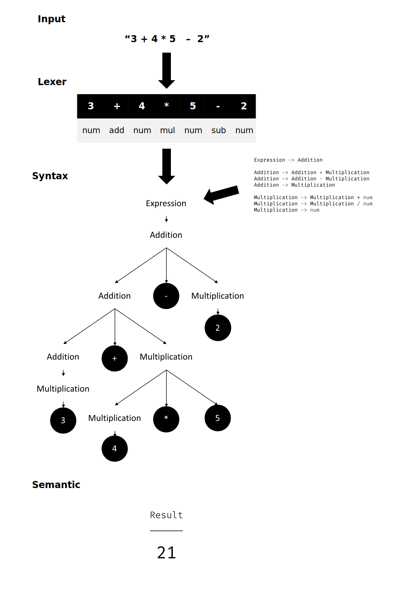

# **C# LALR Parser Generator**

CSharpParserGenerator is a tool that allows you to create LALR grammars. It includes a **lexical**, **syntactic** and **semantic** parser that can work at run time with native C# code.



## Add package

```properties
dotnet add package CSharpParserGenerator
```

## Examples

We recommend reviewing some of the examples available

* [Dynamic Query](./Examples/DynamicQuery) is a sample of how to work with **CSharpParserGenerator** in real use with .Net Core; integrated with features of Entity Framework, Http Requests, Databases, and Linq expressions. The idea of this example is to implement a custom language for querying.
* [Math Expression](./Examples/MathExpression) is a console project with the minimum settings for working with **CSharpParserGenerator**.

# Get started

Before starting, we clarify that it is necessary to have a notion about how to work with LR grammars, the rest of the document will assume that you have the theoretical bases.

## Lexer
The first thing is to define the tokens and required for the lexical parser.

* You can instantiate the lexer as follows
```C#
using CSharpParserGenerator;
// ...
public enum MyLangEnum
{
    IgnoreToken,
    Token1,
    Token2,
    // ...
    TokenN
}
// ...
var tokens = new LexerDefinition<MyLangEnum>(new Dictionary<MyLangEnum, TokenRegex>
{
    [MyLangEnum.IgnoreToken] = "[ \\n]+", // Ignore spaces and line breaks
    [MyLangEnum.Token1] = "regex1",
    [MyLangEnum.Token2] = "regex2",
    // ... 
    [MyLangEnum.TokenN] = "regexN",
});

var lexer = new Lexer<MyLangEnum>(tokens, MyLangEnum.IgnoreToken);
```

As you can see from the code above, each token requires a pattern (Regex string) so that the lexer can identify it when performing the analysis. You must define an Enum with all the tokens of the language, both for terminals and non-terminals.

On the other hand, we have optionally created a token called **IgnoreToken** and have passed it as a parameter of the Lexer. As the name suggests, the lexer will use that token to take the input that matches that pattern and not share it with the Parser during the evaluation. If your language takes any input carater, you can pass the ignore token parameter as null when instantiating the lexer.

## Syntax

The next thing is to define the production rules corresponding to the syntax of our language. So far CSharpParserGenerator only supports **LALR(1) grammars**, so you should take that into account.

```C#
var rules = new GrammarRules<MyLangEnum>(new Dictionary<MyLangEnum, Token[][]>()
{
    [MyLangEnum.NonTerminalToken] = new Token[][]
    {
        new Token[] { /* Production rules */ }
        // ...
    },
    // ...
});
```

For each grammar rule, the non-terminal symbol must be defined as the **key** of a dictionary and the productions it generates in a list of <code>Token[]</code>. To illustrate this, we will use an example grammar:

```prolog
S -> A
A -> A + M
A -> A - M
A -> M
M -> M * T
M -> M / T
M -> T
T -> ( A )
T -> number
```

The above grammar in CSharpParserGenerator can be defined as follows (Ignoring the lexer and semantic actions):

```C#
var rules = new GrammarRules<ELang>(new Dictionary<ELang, Token[][]>()
{
    [ELang.S] = new Token[][]
    {
        new Token[] { ELang.A } // S -> A
    },
    [ELang.A] = new Token[][]
    {
        new Token[] { ELang.A, ELang.Plus, ELang.M }, // A -> A + M
        new Token[] { ELang.A, ELang.Sub, ELang.M }, // A -> A - M
        new Token[] { ELang.M } // A -> M
    },
    [ELang.M] = new Token[][]
    {
        new Token[] { ELang.M, ELang.Mul, ELang.T }, // M -> M * T
        new Token[] { ELang.M, ELang.Div, ELang.T }, // M -> M / T
        new Token[] { ELang.T } // M -> T
    },
    [ELang.T] = new Token[][]
    {
        new Token[] { ELang.LParenthesis, ELang.A, ELang.RParenthesis }, // T -> ( A )
        new Token[] { ELang.Number } // T -> number
    }
});
```

PD: The empty value for CSharpParserGenerator can be represented as <code>new Token[0]</code> or as <code>null</code>.

## Semantic Actions

In most cases, checking that an input string is part of the grammar is not enough, so like any parser it is necessary to have the possibility of applying some logic that allows us to generate some output.

CSharParserGenerator allows you to create semantic actions at any point where we define the grammar rules through the <code>Op</code> class. Here is the format for defining a semantic action:

```C#
var rules = new GrammarRules<MyLangEnum>(new Dictionary<MyLangEnum, Token[][]>()
{
    [MyLangEnum.NonTerminalToken] = new Token[][]
    {
        new Token[] { /* Production rules */, new Op( parseStack => { /* Semantic action */ }) }
        // ...
    },
    // ...
});
```
By calling the parser, for each production rule, at the time of making a reduction it is verified if there is a semantic action; if any are found, a callback is made by sending the parseStack.

To explain how to work with semantic actions, we will start from the following example:

```C#
var rules = new GrammarRules<MyLangEnum>(new Dictionary<MyLangEnum, Token[][]>()
{
    // ...
    [ELang.A] = new Token[][]
    {
        // A -> B + C
        new Token[] { ELang.B, ELang.Plus, ELang.C, new Op(o => { o[0] = o[0] + o[2]; }) },
        // ...
    }
    // ...
}
```

It can be seen in the example above that it seeks to execute a sum operation between **B** and **C** and then raise the resulting value to the non-terminal **A**. Just before reducing the rule <code>A -> B + C</code>, the associated semantic action will be executed by sending the **ParseStack** as a parameter the current state of the stack. In this case, the **ParseStack** will have mapped the value of **B** in position 0 (<code>o[0]</code>), **Plus** (+) in position 1 (<code>o[1]</code>) and **C** in position 2 (<code>o[2]</code>). 

The parser will always raise the value of the element that is in position 0. For this particular case, the desire would be to overwrite the element <code>o[0]</code> with the result of that sum. That is the reason for the operation <code>o[0] = o[0] + o[2]</code> in the example above.

You can guide yourself with [this example](./Examples/MathExpression/Program.cs) on how to apply everything mentioned so far.

## Semantic Actions in Mid-Rule

Occasionally it is helpful to put an action in the middle of a rule. These actions are written as the usual end-of-rule actions, but are executed before the parser recognizes the following components.

```C#
var rules = new GrammarRules<MyLangEnum>(new Dictionary<MyLangEnum, Token[][]>()
{
    // ...
    [ELang.A] = new Token[][]
    {
        /*
            B   => o[0]  
            Op1 => o[1]  
            C   => o[2]
            D   => o[3]
            Op2 => o[4]
        */
        new Token[] { ELang.B, new Op(o => {/*Op1*/}), ELang.C, ELang.D, new Op(o => {/*Op2*/}) },
        // ...
    }
    // ...
}
```

In the previous rule defined as <code>A -> B C D</code> it can be observed that there is a semantic action in the middle of the rule. The rules are executed from left to right, so Op1 will be evaluated before Op2 in the example above. It is important to note that semantic actions are part of the assigned positions in the parseStack. Also that at the time of executing any semantic action to rule mid, you only have access to values that are on your left, access any item on the right will raise an **IndexOutOfRangeException**.

You can find an example that uses Semantic Actions in Mid-Rule [here](./CSharpParserGenerator.Test/UnitTests/ComplexGrammar.cs).

## Parser

After having the lexer the grammatical rules defined, the only thing missing is to compile the parser and it will be ready to go.

```C#
// Run only once
var myParser = new ParserGenerator<MyLangEnum>(lexer, rules).CompileParser();

// Run as many times as you want
var result = myParser.Parse<TOutput>(inputString);
```

We recommend that during the execution of your program, you only compile the Parser once for each language you define, since that is when the state table is generated (this action can be quite expensive). After having a instance of compiled parser, you can call the **Parse** method as many times as you want, even make asynchronous calls as long as your semantic actions are also thread safe.